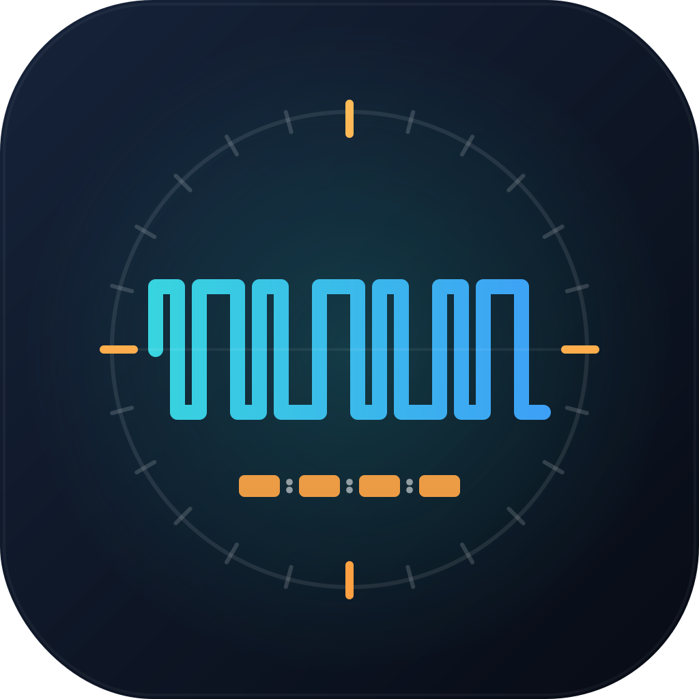

# LTC to LV1

<p align="center">
  
</p>

A Windows and macOS desktop application that reads **SMPTE LTC (Linear Timecode)** from an audio input and **recalls Waves LV1 snapshots over OSC** at frame-accurate timecodes — ideal for automating snapshot changes on a Waves LV1 mixing desk during live shows.

This is the successor to **LTC to MIDI**: instead of sending MIDI Program Change messages, this version talks the **same wire-level OSC-over-TCP protocol as the iPad MyFOH app** directly to the LV1. No loopMIDI / IAC Driver / MIDI cable needed.

---

## Features

- **Windows and macOS** — single codebase, native feel on both
- **Auto-discovery** of LV1s on the LAN (multicast on `225.1.1.1:13337`)
- **Manual IP override** for routed networks
- **Reads LTC from any audio input** — ASIO, WDM, MME on Windows; CoreAudio on macOS
- **ASIO channel names** shown in the dropdown (e.g. "SoundGrid 1")
- Software BMC/LTC decoder — no external libraries
- Supports 24 / 25 / 29.97 / 30 / 50 / 59.94 / 60 fps + drop-frame
- **Cues fire by scene NAME** — robust to LV1 scene reordering between sessions
- **Live scene catalog panel** — see every snapshot on the LV1 in real time
- **Status colours per cue:** OK / RECOVERED (name found at different index) / MISSING / EMPTY
- **Fuzzy suggestions** when a cue name doesn't match exactly — "did you mean …?"
- **Validation popup** on connect — every broken cue listed up front
- **Dry-run mode** — fire cues without sending OSC (rehearse the cue list)
- **TAP** button to capture live timecode into a new cue
- **Test Fire** to verify a snapshot recall without waiting for timecode
- **Enable/Disable** individual cues without deleting them
- **Frame tolerance** setting for real-world jitter
- **MIDI cue-list import** — JSON files from the old LTC to MIDI app are loaded automatically; you just associate each cue with the right LV1 scene by name and save in the new format

---

## Quick Start

1. **Connect** your LTC source to an audio input on your interface
2. Open **LTC to LV1**
3. Pick the **Audio Input** device and the channel carrying the LTC signal
4. The **LV1 (discover)** dropdown auto-fills after ~5 s of multicast scanning. Pick yours.
   - For routed networks, fill the **IP** field manually (port 0 = auto)
5. Click **Connect LV1** — the scene catalog appears on the right
6. Click **▶ START** — the timecode display turns bright green when LTC is detected
7. Add cues: pick the LV1 scene from the dropdown in the cue dialog
8. Press Play on your timeline — cues fire automatically

---

## Cue List

| Column   | Description                                                |
|----------|------------------------------------------------------------|
| #        | Cue order number                                           |
| Timecode | HH:MM:SS:FF — when to fire                                |
| Label    | Free text description                                      |
| LV1 Scene| `[index] Scene Name`                                       |
| Status   | OK / RECOVERED / MISSING / EMPTY (colour-coded)            |
| ✓        | Enabled (● active / ○ disabled). Click to toggle           |

Cues fire once per playback pass. They reset automatically when TC jumps backwards by more than 1 second. Use **↺ Reset** to manually reset all fired flags before a new run-through.

Cue lists are saved as `.json` — easy to edit in any text editor.

---

## Scene Resolution

Each cue stores the **scene name** as the authoritative reference, plus a cached **index hint**. When you connect to the LV1, the app reconciles the two:

- **OK** — name found, index unchanged
- **RECOVERED** — name found at a different index (hint refreshed automatically)
- **MISSING** — name not in catalog; cue will not fire until fixed
- **EMPTY** — no name stored (typically an imported MIDI cue)

The validation popup that appears on connect lists every problem cue so you can fix them up front.

---

## Talking to the LV1

The app uses the same OSC-over-TCP protocol as the iPad MyFOH app — proprietary 4-byte length + 8-byte header framing, MyFOH-style `/handshake` registration, `/ping`/`/pong` keepalive. It registers in the LV1's MyRemote ControlPanel as a device named `LTCtoLV1`.

Snapshots are recalled with `/Set/CurSceneIndex i:<index>`. The catalog is read from `/Notify/SceneList` (sent by the LV1 on connect and after every snapshot save/rename).

---

## Importing an old LTC to MIDI cue list

1. **File → Open** and pick your old `.json`
2. A notice tells you the file was imported from the MIDI format — each cue's Program Change number is kept as a *scene index hint*, but the name is empty
3. Edit each cue and pick the right scene from the dropdown (the LV1 must be connected so the catalog is loaded)
4. **Save** — the file is now stored in the new format

---

## Building from Source

Requirements: Python 3.12+ and the packages in `requirements.txt`.

```bash
pip install -r requirements.txt
python main.py
```

To build the standalone executables:

- **Windows:** `build.bat` → `dist/LTCtoLV1.exe`
- **macOS:** `bash build.sh` → `dist/LTCtoLV1.app` + `dist/LTCtoLV1.dmg`
  (requires `brew install create-dmg`)

---

## License

MIT — free to use, modify and distribute.
